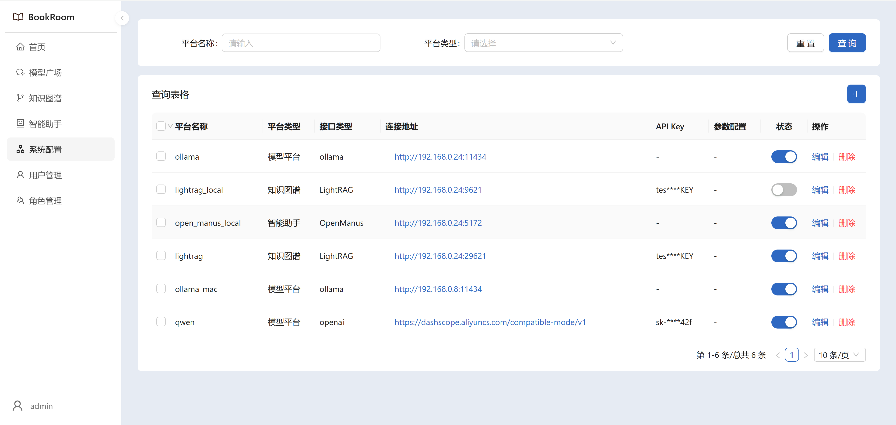
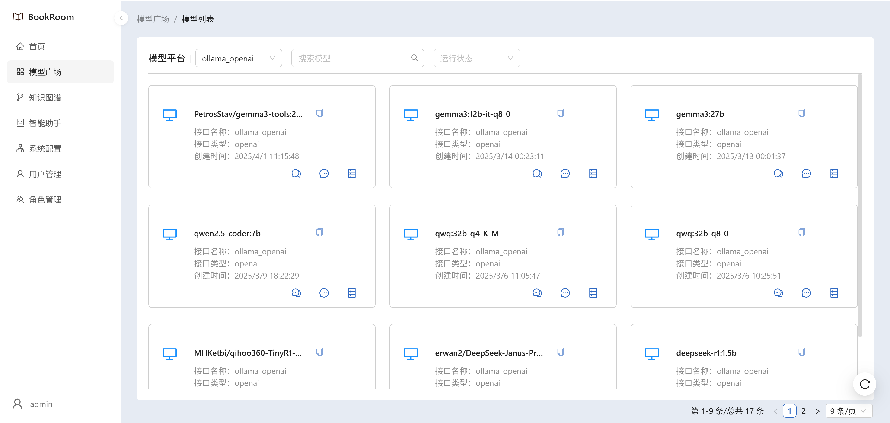
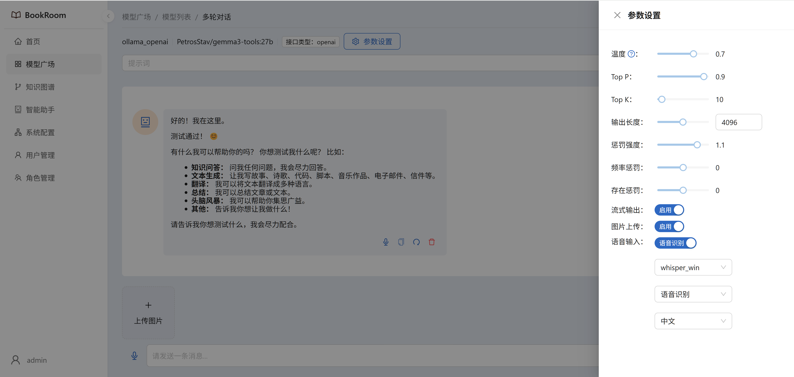
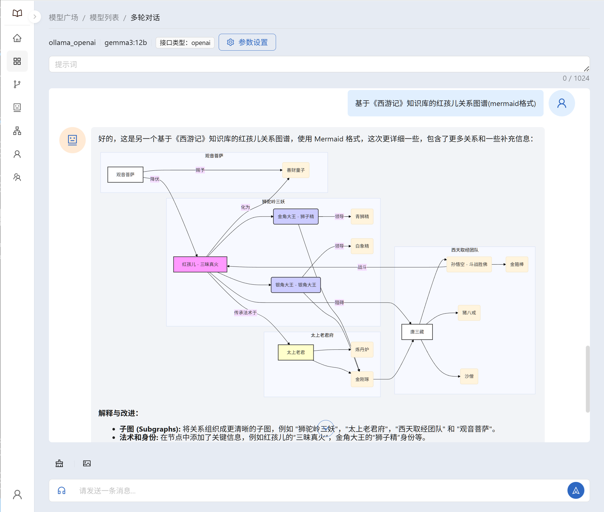
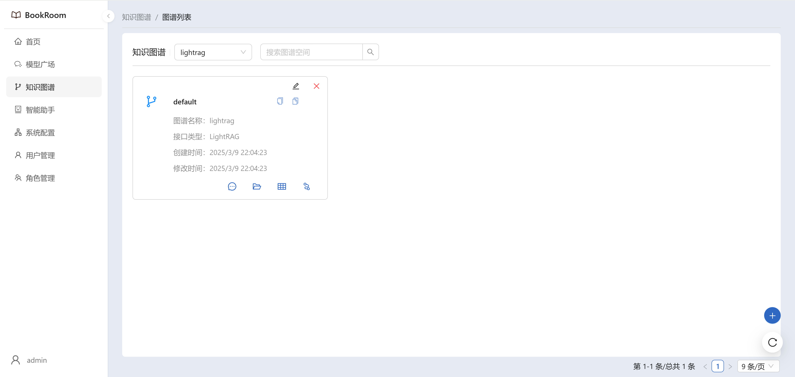
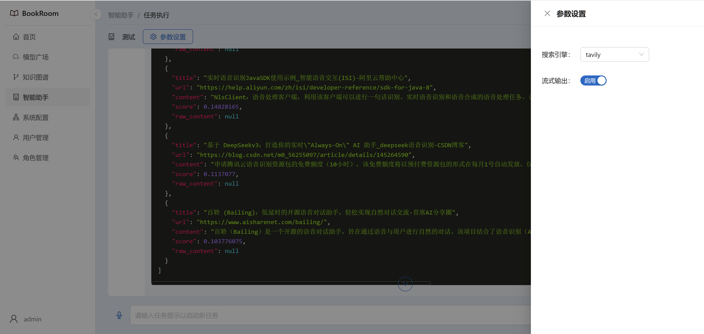
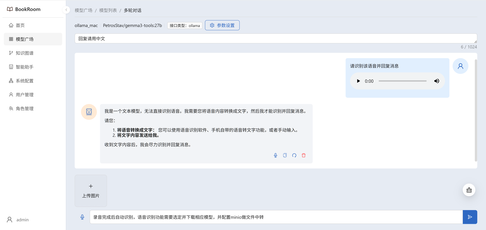
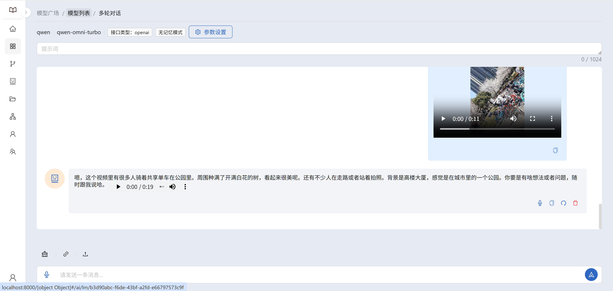
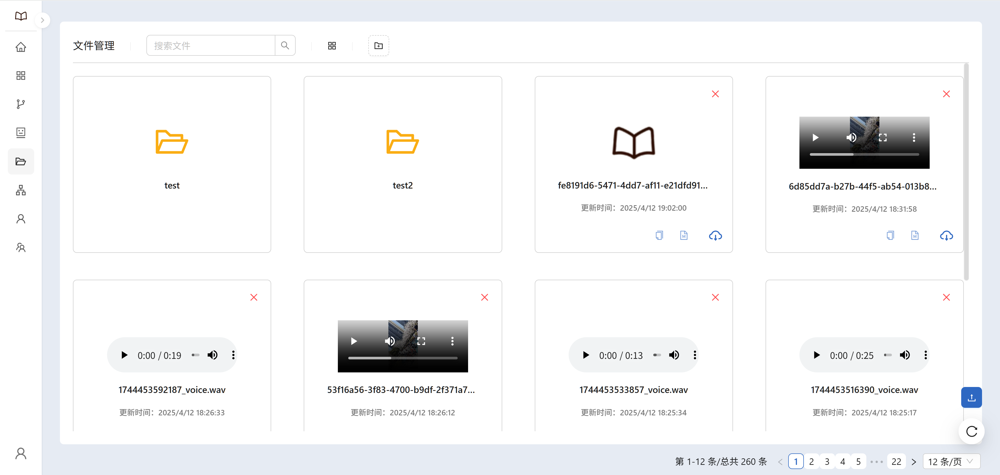

# BookRoom
> A book room based Agent | 智能书库
> 
> [https://github.com/sndraw/bookroom](https://github.com/sndraw/bookroom) 

## 项目介绍
> 该项目是一个基于家庭、学校或组织的私有知识库(知识图谱)管理平台，旨在提供一个集中的地方来管理和使用各种智能助手和深度学习模型，以实现知识的自动化和智能化管理。
> 
> 平台支持人工、半自动或完全自动化的方式构建和管理知识库(知识图谱)，以便更好地理解和利用数据。
> 
> 平台支持多种模型，包括自然语言处理、计算机视觉、语音识别等，并提供多平台部署选项，以便在不同的设备和环境中使用。
> 
> 此外，平台还提供了模型问答功能，用户可以通过输入问题来获取模型的回答，从而快速获取所需的知识信息。


## 功能介绍
- ### 模型部署（多平台模型管理、模型问答）
  - [ollama](https://github.com/ollama/ollama)
  - [千问百炼](https://bailian.console.aliyun.com/)
  - [openai](https://github.com/openai/openai-python)

- ### 知识图谱（多知识图谱管理、2D/3D图谱展示、图谱问答）- 功能完善中
  - [LightRAG](https://github.com/HKUDS/LightRAG)
  - [BookRoom RAG](https://github.com/sndraw/bookroom-rag)

- ### 智能助手（多智能助手管理、自动执行任务）- 功能架构中
  - [BookRoom Agents](https://github.com/sndraw/bookroom-agents)

- ### 语音识别（本地语音识别、云端语音识别）- 功能完善中
  - [BookRoom Audio](https://github.com/sndraw/bookroom-audio)

- ### 智能管家 （智能设备管理、任务调度设置）- 功能架构中
  - [BookRoom Robot](https://github.com/sndraw/bookroom-robot)

- ### 文件管理
  - 文件上传和下载管理
  - 多文件类型支持（图片、视频、文档等）

- ### 用户管理
  - 用户注册和登录管理
  - 权限控制和角色管理

- ### 开发计划
  - [待完善功能列表](./docs/devplan.md)

## 目录结构
```text
- 根目录/
  - docker-deploy/ 
  - bookroom-api/
  - bookroom-web/
  - README.md
```
## 部署文档
- [/bookroom-api/README.md](./bookroom-api/README.md)
- [/bookroom-web/README.md](./bookroom-web/README.md)
- [/docker-deploy/README.md](./docker-deploy/README.md)

## 系统配置示例
#### 模型平台-接口类型
> 1. Ollama：http://192.168.1.2:11434
> 2. OpenAI：https://dashscope.aliyuncs.com/compatible-mode/v1

#### 知识图谱-接口类型 - 完善中
> 1. LightRAG：http://192.168.1.2:19621
> 2. BookRoom RAG: http://192.168.1.2:19621

#### 智能助手-接口类型 - 开发中
> 1. Agent API: http://192.168.1.2:25230
> 2. MCP SDK: http://192.168.1.2:25231
> 3. Agents SDK: http://192.168.1.2:25232

#### 搜索引擎-接口类型 - 开发中
> 1. Tavily: https://api.tavily.com
> 2. 天气查询：https://your-weather-api.com/weather
> 3. 自定义搜索: https://your-custom-search-engine.com/s

#### 语音识别-接口类型 - 完善中
> 1. OpenAI: http://192.168.1.2:25231/v1

## 截图展示
### 系统配置
  
### 模型管理
 
### 模型配置
  
### 模型对话
  
### 图谱空间
  
### 图谱编辑
  
### 图谱展示

### 智能助手

### 语音识别

### 视频识别

### 文件管理


## 📚 相关文档
### LightRAG-运行流程
  


## ☕ Sponsor
[Buy Me a Coffee](docs/sponsor.md)

## 📃 License
[LICENSE](./LICENSE)

## ⭐️ Star History
[](https://www.star-history.com/#sndraw/bookroom&Date)


## 🚀 Contribution

欢迎加入开源社区！

Welcome to Contribute to Open Source!


<a href="https://github.com/sndraw/bookroom/graphs/contributors">
  
</a>
